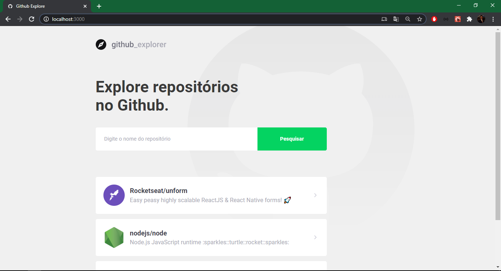
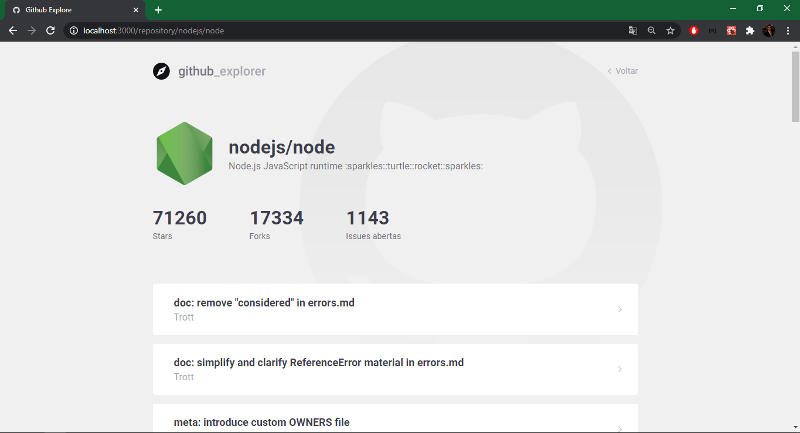

    

    
    
    
    
    
    
    
    

  <a href="#-Sobre-o-desafio">🚀 Tecnologias</a>&nbsp;&nbsp;&nbsp;|&nbsp;&nbsp;&nbsp;
  <a href="#-Projeto">💻 Layout</a>

# 🚀 Tecnologias

Este projeto foi desenvolvido com as seguintes tecnologias:

* [React](https://pt-br.reactjs.org/)
* [React DOM](https://pt-br.reactjs.org/docs/react-dom.html)
* [React Router DOM](https://www.npmjs.com/package/react-router-dom)
* [Axios](https://www.npmjs.com/package/axios)
* [TypeScript](https://www.typescriptlang.org/)
* [Styled Components](https://styled-components.com/)

# 💻 Layout

      
    

---

Desenvolvido com 💚 por [Felipe Zanetti!](https://www.linkedin.com/in/felipezanetti/)
